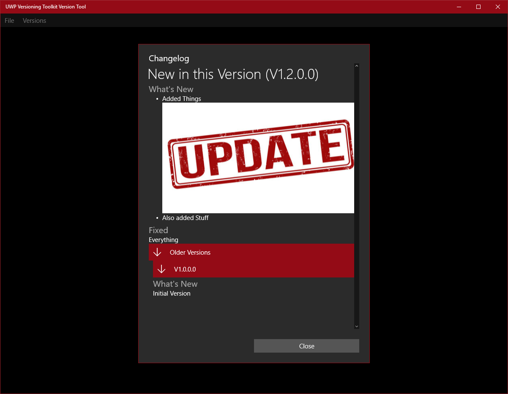

# UWP Versioning Toolkit
A MarkDown based Versioning Toolkit, for creating Rich App Changelogs.
This Toolkit allows you to create a Changelog File, as well as a Client-Side Library to Load and Present the Changelog, when there is a new version.

## Get the Version Tool
Store Link: Coming Soon

AppX Link: Coming Soon

## Get the Client-Side SDK
NuGet: [Link](https://www.nuget.org/packages/UWPVersioningToolkit.ClientSide)

## Recommended Usage
1. Create a Changelog.json File using the Version Tool, populated with at least one Changelog.
2. Copy this file into your Main App Directory, which can be achieved with Visual Studio by dragging the file onto the Project Header.
3. Ensure that the `Build Action` for the file is set to `Content`.
Optional: Override the `ChangeDialogHandler` to handle ChangeDialog events, Replace the strings in `ChangelogStrings` with Mutli Lingual Strings.
4. Some time during the Startup of your app, call `VersionHelper.CheckForUpdates()` or `VersionHelper.CheckForUpdatesAsync()`, this will ensure that the Changelog hasn't been checked, and that it is a new Version, and then Show the Change Dialog.
Optional: Add a button to your App Settings to open the Changelog (Using `VersionHelper.ShowChangelog`)
